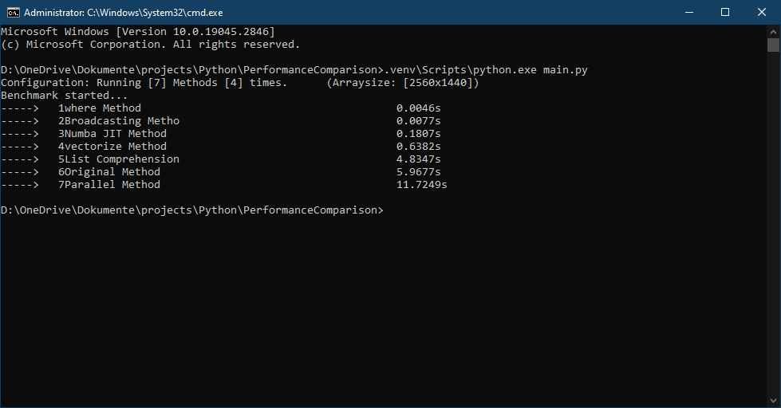
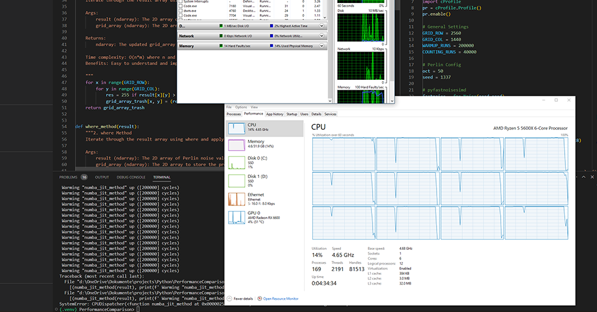

# Performance Comparison of 2D Array Iteration Techniques in Python

This repository contains my analysis and comparison of various techniques to iterate through a 2D NumPy array in Python. My goal is to determine the most performant method for my specific use case (AntSim), which involves filtering and modifying the original array based on certain conditions.

## Problem

The initial problem involves iterating through a 2D array of Perlin noise values with dimensions `2560x1440` (ROW x COL), and assigning the result to another 2D array, `grid_array`, based on the following filter and operation:

- Filter: The Perlin noise value at `result[x][y]` has to be > 0.
- Operation: Multiply the value by 255.

The original code using nested loops looks like this:

```python
for x in range(0, GRID_ROW):
    for y in range(0, GRID_COL):
        res = 255 if result[x][y] < 0 else 0
        grid_array[x, y] = (res, 0, 0)
```

## Testing Methodology

To determine the most performant method for this specific use case, I tested the following techniques:

1. Original nested loop method
2. Using `np.where`
3. Using `np.vectorize`
4. Using NumPy broadcasting
5. Using list comprehensions
6. Using Numba JIT compilation
7. Using joblib for parallelization

The performance of each method was measured using the `timeit` module in Python. Each method was timed for ``4 runs`` and the average execution time was calculated.

## Results

Here are the results for the performance comparison:

| Method                   | Average Execution Time (ms) |
| ------------------------ | --------------------------- |
| <span style="color:#90f768">1. np.where Method</span>          | <span style="color:#90f768">0.0046s</span>                        |
| <span style="color:#acb333">2. Broadcasting Method</span>       | <span style="color:#acb333">0.0077s</span>                         |
| <span style="color:#acb333">3. Numba JIT Method</span>          | <span style="color:#acb333">0.1807s</span>                         |
| <span style="color:#ff8e15">4. np.vectorize Method</span>      | <span style="color:#ff8e15">0.6382s</span>                        |
| <span style="color:#ff4e10">5. List Comprehension Method</span>| <span style="color:#ff4e10">4.8347s</span>                       |
| <span style="color:#ff4e10">6. Original Method</span>           | <span style="color:#ff4e10">5.9677s</span>                         |
| <span style="color:#7e0606">7. Parallel Method</span>          | <span style="color:#7e0606">11.7249s</span>                        |



## Conclusions

Based on the test results, the most performant method for this specific use case is `np.where` or basically any `numpy low-level array manipulation`. It's important to note that the performance of these methods may vary depending on the size of the dataset and the complexity of the operations. Make sure to test these methods on your specific use case to determine which one is most suitable for your needs. 

## Noteworthy
I couldnt make much use of `Numba JIT Method` even though i added some `"warmup"` function which almost burned my PC.
I had a lot of fun experementing!



Please refer to the [main script](./main.py) to see the actual code and performance testing setup.
